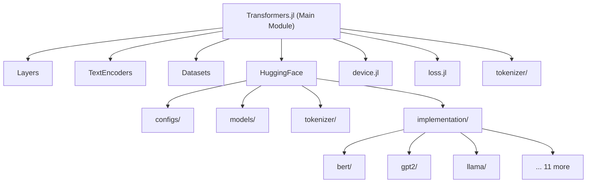
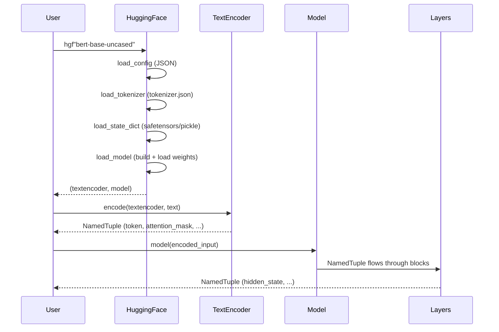

# Transformers.jl — Codebase Architecture Guide

> Julia implementation of transformer-based models with HuggingFace integration. Version 0.3.1.

## High-Level Architecture

---

## Module Breakdown

### 1. `src/Transformers.jl` — Entry Point
- **Purpose**: Root module, loads all submodules
- **Key exports**: `Transformer`, `todevice`, `enable_gpu`, `Layers`, `TextEncoders`, `HuggingFace`, `Masks`
- **Pattern**: Defines `Container{T} = Union{NTuple{N,T}, Vector{T}}` type alias used throughout

---

### 2. `src/device.jl` — GPU Device Management
- **Purpose**: Abstracts GPU/CPU device transfer with caching
- **Key functions**: `enable_gpu()`, `todevice()`, `togpudevice()`, `toxdevice()`
- **Design**: Uses `@eval` to redefine `todevice` at runtime based on GPU backend
- **Custom caching**: `AdaptorCache` wraps `IdDict` with type-stable `getindex` via `@generated` function
- **AdaptorWalk**: Custom `Functors.AbstractWalk` that caches adapted values

> [!WARNING]
> Uses `Flux.GPU_BACKEND` constant which was **removed in Flux v0.14.23** (Issue [#201](https://github.com/chengchingwen/Transformers.jl/issues/201)). This breaks precompilation entirely.

---

### 3. `src/loss.jl` — Loss Functions (547 lines)
- **Purpose**: Masked cross-entropy and logit cross-entropy with custom autodiff rules
- **Functions**: `crossentropy`, `logitcrossentropy`, `safe_crossentropy`, `safe_logitcrossentropy`, plus `unsafe_*` variants
- **Pattern**: Extends `Flux.Losses` with `AbstractSeqMask` support from `NeuralAttentionlib`
- **Custom rrules**: Hand-written `ChainRulesCore.rrule` for all loss variants for performance
- **Integer labels**: Special paths for integer array labels vs one-hot

---

### 4. `src/layers/` — Neural Network Layers

#### [Layers.jl](file:///home/abr/Documents/GitHub/Julia/Transformers.jl/src/layers/Layers.jl)
Module definition. Exports: `Seq2Seq`, `Transformer`, `TransformerBlock`, `TransformerDecoderBlock`, `PreNormTransformerBlock`, `PostNormTransformerBlock`, embedding types.

#### [architecture.jl](file:///home/abr/Documents/GitHub/Julia/Transformers.jl/src/layers/architecture.jl) — Layer Composition Framework (385 lines)
**Core design pattern**: All data flows as `NamedTuple`s through the model. Each layer declares which named fields it consumes via `argument_names()`.

| Type | Purpose |
|------|---------|
| `Architecture` | Abstract base for all composable layers |
| `LayerStruct` | Abstract base for layers with inner structure |
| `Layer{names}` | Parametric layer declaring input field names |
| `WithArg{names}` | Wraps any function to consume specific named fields |
| `WithOptArg{names, opts}` | Like `WithArg` but with optional fields |
| `RenameArgs` | Renames NamedTuple keys before/after passing to inner layer |
| `Branch{target}` | Routes output to a specific named field |
| `Parallel{names}` | Applies layers in parallel to different named fields |
| `Chain` | Sequential composition (like `Flux.Chain` but for NamedTuples) |

Key function: `apply_on_namedtuple(layer, nt)` — dispatches layer call on relevant subset of NamedTuple fields.

#### [base.jl](file:///home/abr/Documents/GitHub/Julia/Transformers.jl/src/layers/base.jl) — Core Primitives (342 lines)
- `Fork`: Apply multiple layers to same input, return tuple
- `NSplit`: Split single output into N parts along first dim
- `Dense`: Custom dense layer with fused activation + bias (not `Flux.Dense`)
- `LayerNorm`, `RMSLayerNorm`: Standard normalization layers
- Custom `dense()` function with hand-optimized `rrule` and activation-specific backward passes (`gelu_forward_backward`, `swish_forward_backward`)
- Weight initialization: `init_weight(T, s...)` → randn × 0.02

#### [layer.jl](file:///home/abr/Documents/GitHub/Julia/Transformers.jl/src/layers/layer.jl) — Transformer Blocks (687 lines)
- `SelfAttention`: QKV projection → attention → output projection
- `CrossAttention`: Separate Q and KV projections for encoder-decoder
- `TransformerBlock{A, F}`: Self-attention + feedforward with residual connections
- `TransformerDecoderBlock{A, C, F}`: Self-attention + cross-attention + feedforward
- `PreNormResidual` / `PostNormResidual`: LayerNorm before/after residual
- `Transformer`: Container of stacked blocks, uses `applyblocks` with `@generated` unrolling
- `collect_outputs`: Accumulates hidden states from each block
- `DropoutLayer`: Wraps any layer with dropout

#### [embed.jl](file:///home/abr/Documents/GitHub/Julia/Transformers.jl/src/layers/embed.jl) — Embeddings (272 lines)
- `Embed`: Token embedding via `NNlib.gather`, optional scaling
- `EmbedDecoder`: Tied embeddings (shares weight with `Embed`) for output logits
- `FixedLenPositionEmbed`: Trainable position embeddings
- `SinCosPositionEmbed`: Sinusoidal position embeddings
- `ApplyEmbed`: Adds position embeddings to token embeddings

#### [attention_op.jl](file:///home/abr/Documents/GitHub/Julia/Transformers.jl/src/layers/attention_op.jl) — Attention Operations
- Wraps `NeuralAttentionlib` attention ops
- `PreNormMultiheadQKVAttenOp`, `PostNormMultiheadQKVAttenOp`
- RoPE (Rotary Position Embedding) support via `WithScore`
- Custom attention score wrappers

#### [testmode.jl](file:///home/abr/Documents/GitHub/Julia/Transformers.jl/src/layers/testmode.jl)
- Recursive `testmode()` that removes dropout (`DropoutLayer.p → nothing`)

#### [structwalk.jl](file:///home/abr/Documents/GitHub/Julia/Transformers.jl/src/layers/structwalk.jl)
- Defines `LayerStyle` for `StructWalk` traversal of model trees

---

### 5. `src/huggingface/` — HuggingFace Integration

#### [HuggingFace.jl](file:///home/abr/Documents/GitHub/Julia/Transformers.jl/src/huggingface/HuggingFace.jl) — Module Entry
- **Exports**: `@hgf_str`, `load_config`, `load_model`, `load_tokenizer`, `load_state_dict`, `load_hgf_pretrained`
- **`@hgf_str` macro**: Main user API — `hgf"bert-base-uncased"` returns `(tokenizer, model)`
- **`load_hgf_pretrained`**: Parses `name:item` syntax, loads config → tokenizer → model

#### [download.jl](file:///home/abr/Documents/GitHub/Julia/Transformers.jl/src/huggingface/download.jl) — File URLs & Download
- Defines all HuggingFace file constants (weight files, tokenizer files, config)
- Wraps `HuggingFaceApi.hf_hub_download` for caching

#### [configs/config.jl](file:///home/abr/Documents/GitHub/Julia/Transformers.jl/src/huggingface/configs/config.jl) — Configuration System
- `HGFConfig{name, C, E}`: Parametric config type with alias support
- Supports field aliases (e.g., `hidden_size` ↔ `n_embd` for GPT-2)
- Default values from `DEFAULT_PRETRAIN_CONFIG`
- Distinction: `propertynames`/`getproperty` use defaults, `keys`/`haskey` don't

#### [configs/default.jl](file:///home/abr/Documents/GitHub/Julia/Transformers.jl/src/huggingface/configs/default.jl)
- Default config values shared across all model types

#### [configs/auto.jl](file:///home/abr/Documents/GitHub/Julia/Transformers.jl/src/huggingface/configs/auto.jl)
- `load_config()` — auto-detects model type from `config.json`

#### [weight.jl](file:///home/abr/Documents/GitHub/Julia/Transformers.jl/src/huggingface/weight.jl) — Weight Loading
- Supports both PyTorch pickle (`.bin`) and SafeTensors (`.safetensors`) formats
- **Weight format detection order**: Pickle first, SafeTensors second (should prefer SafeTensors)
- `HasWeightIn`, `HasSingleFile`, `HasIndexMap`: Type hierarchy for weight status
- Shared tensor restoration from SafeTensors metadata

#### [models/load.jl](file:///home/abr/Documents/GitHub/Julia/Transformers.jl/src/huggingface/models/load.jl) — Model Loading Infrastructure
- `HGFPreTrainedModel` / `HGFPreTrained{model_type, task}`: Type hierarchy
- `@hgfdef` macro: Generates model structs + forward functions from field declarations
- `getweight()`: Loads weight from state_dict with lazy loading support
- `get_state_dict()`: Extracts state dict from model (for saving)
- `ACT2FN`: Activation function mapping with aliases
- `_load_embed`, `_load_layernorm`, `_load_dense`: Weight loading helpers

#### [models/models.jl](file:///home/abr/Documents/GitHub/Julia/Transformers.jl/src/huggingface/models/models.jl) — Model Management
- `load_model`: Multi-dispatch chain for model loading
- `save_model`: Saves model state dict

> [!CAUTION]
> **Bug in `save_model`**: References undefined variable `force` (should be a keyword argument). Will error at runtime.

#### [tokenizer/](file:///home/abr/Documents/GitHub/Julia/Transformers.jl/src/huggingface/tokenizer/) — HuggingFace Tokenizer Loading
- `fast_tkr.jl` (635 lines): Parses `tokenizer.json` (HuggingFace "fast" tokenizer format)
  - Supports: BPE, WordPiece, Unigram, WordLevel methods
  - Pre-tokenizers: BertPreTokenizer, Metaspace, Split, WhitespaceSplit, Sequence
  - Normalizers, post-processors, decoders
- `slow_tkr.jl`: Fallback for "slow" tokenizer format
- `utils.jl`: Vocabulary building, added tokens

#### [implementation/](file:///home/abr/Documents/GitHub/Julia/Transformers.jl/src/huggingface/implementation/) — 14 Model Implementations
Each model has its own subdirectory with 3-5 files:

| Model | Directory | Tasks Supported |
|-------|-----------|-----------------|
| BERT | `bert/` | model, ForMaskedLM, ForSequenceClassification, ForTokenClassification |
| DistilBERT | `distilbert/` | model, ForMaskedLM |
| GPT-2 | `gpt2/` | model, LMHeadModel |
| GPT | `gpt/` | model, LMHeadModel |
| GPT-Neo | `gpt_neo/` | model, LMHeadModel |
| GPT-NeoX | `gpt_neox/` | model, ForCausalLM |
| GPT-J | `gptj/` | model, ForCausalLM |
| LLaMA | `llama/` | model, ForCausalLM |
| BART | `bart/` | model, ForConditionalGeneration |
| T5 | `t5/` | model, ForConditionalGeneration |
| RoBERTa | `roberta/` | model, ForMaskedLM |
| BLOOM | `bloom/` | model, ForCausalLM |
| CLIP | `clip/` | model + vision/text submodels |
| Phi | `phi/` | model, ForCausalLM |

---

### 6. `src/textencoders/` — Text Encoding Pipeline

#### [TextEncoders.jl](file:///home/abr/Documents/GitHub/Julia/Transformers.jl/src/textencoders/TextEncoders.jl) — Core (300 lines)
- `AbstractTransformerTextEncoder`: Abstract base
- `TrfTextEncoder`: Configurable pipeline: annotate → tokenize → process → one-hot → decode
- `TransformerTextEncoder`: Convenience constructor with default processing pipeline
- Processing pipeline: tokenization → sequence wrapping → truncation → padding → one-hot encoding

#### Model-specific encoders
- `bert_textencoder.jl` / `bert_tokenizer.jl`: BERT-style with `[CLS]`/`[SEP]` tokens
- `gpt_textencoder.jl` / `gpt_tokenizer.jl`: GPT-style with BPE
- `t5_textencoder.jl`: T5-style with SentencePiece

---

### 7. `src/tokenizer/` — Tokenizer Implementations
- `wordpiece/`: WordPiece tokenization (BERT-style)
- `unigram/`: Unigram tokenization (SentencePiece)

---

### 8. `src/datasets/` — Dataset Loading
- `Datasets.jl`: Module entry with `DataDeps` integration
- GLUE benchmark: CoLA, SST, MRPC, QQP, MNLI, QNLI, RTE, WNLI, STS, SNLI, Diagnostic
- Translation: WMT, IWSLT, Google WMT
- QA: Cloze test, StoryCloze

---

### 9. `ext/` — GPU Extensions
- `TransformersCUDAExt.jl`: CUDA device transfer via `FluxCUDAExt`
- `TransformersAMDGPUExt.jl`: AMDGPU device transfer
- `TransformersMetalExt.jl`: Metal device transfer

> [!WARNING]
> **Precompilation bug** (Issue [#214](https://github.com/chengchingwen/Transformers.jl/issues/214)): `Base.get_extension(Flux, :FluxCUDAExt)` returns `nothing` during precompilation, breaking CUDA support.

---

### 10. `test/` — Test Suite
- `runtests.jl`: Test runner with optional CUDA testing
- Test directories: `tokenizer/`, `huggingface/`
- Test files: `loss.jl`, `grad.jl`
- HuggingFace tokenizer tests gated behind `JL_TRF_TEST_TKR` env var

---

## Key Dependencies (40+ packages)

| Category | Package | Purpose |
|----------|---------|---------|
| **ML Framework** | `Flux` | Neural network framework |
| **Attention** | `NeuralAttentionlib` | Attention operations, masks |
| **Autodiff** | `Zygote`, `ChainRulesCore` | Automatic differentiation |
| **Functors** | `Functors`, `StructWalk` | Model traversal |
| **Tokenization** | `BytePairEncoding`, `WordTokenizers`, `TextEncodeBase` | Text processing |
| **File formats** | `Pickle`, `SafeTensors`, `JSON3` | Weight/config loading |
| **HuggingFace** | `HuggingFaceApi` | Hub download/caching |
| **Data** | `DataDeps`, `DataStructures` | Dataset/data management |
| **Performance** | `Static`, `PrimitiveOneHot`, `FillArrays` | Type-level optimizations |
| **Misc** | `LRUCache`, `LightXML`, `DoubleArrayTries` | BPE caching, XML parsing, trie structures |

---

## Data Flow

