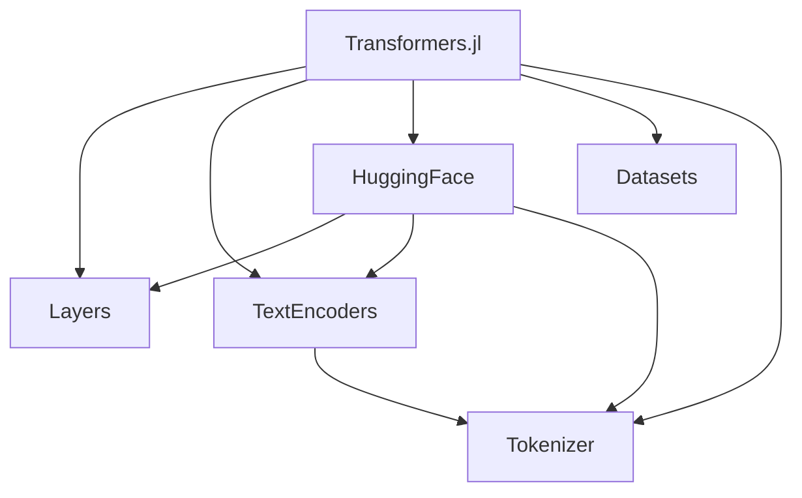

# Transformers.jl — Design Patterns & Dependency Audit

## Overview

This document analyzes the design patterns in Transformers.jl, evaluates each for maintainability and performance, audits dependency freshness, and proposes a package splitting strategy.

---

## 1. Design Pattern Analysis

### 1.1 NamedTuple-Driven Data Flow ✅ Good Pattern

**Where**: [architecture.jl](file:///home/abr/Documents/GitHub/Julia/Transformers.jl/src/layers/architecture.jl), [layer.jl](file:///home/abr/Documents/GitHub/Julia/Transformers.jl/src/layers/layer.jl)

All layer composition uses `NamedTuple` as the universal data container, enabling named argument routing through transformer blocks:

```julia
(b::TransformerBlock)(nt::NamedTuple) =
    apply_on_namedtuple(b.feedforward, apply_on_namedtuple(b.attention, nt))
```

**Verdict**: This is a **strong pattern** for Julia. NamedTuples are:
- Type-stable (compiler knows field names at compile time)
- Zero-overhead (no runtime allocation for field access)
- Self-documenting (fields like `:hidden_state`, `:attention_mask`)

> [!TIP]
> Keep this pattern. It gives Transformers.jl a real advantage over Python implementations where `dict`-based data flow prevents compiler optimization.

---

### 1.2 `@generated` Functions — 14 Sites ⚠️ Valid but Risky

**Where**: [architecture.jl](file:///home/abr/Documents/GitHub/Julia/Transformers.jl/src/layers/architecture.jl#L43-L61) (8 sites), [layer.jl](file:///home/abr/Documents/GitHub/Julia/Transformers.jl/src/layers/layer.jl#L220) (3 sites), [utils.jl](file:///home/abr/Documents/GitHub/Julia/Transformers.jl/src/layers/utils.jl#L51) (1 site), [base.jl](file:///home/abr/Documents/GitHub/Julia/Transformers.jl/src/layers/base.jl#L30) (2 sites)

All follow the same dual-path pattern:
```julia
function (c::Chain)(nt::NamedTuple)
    if @generated
        N = length(c.parameters[1].parameters)
        # ... build expr at compile time ...
    else
        return foldl((y, l) -> l(y), c.layers; init = nt)  # fallback
    end
end
```

**Verdict**: These are **performance-justified** — they unroll loops over tuple elements at compile time. However:

> [!WARNING]
> **Risk**: `@generated` functions in Julia are fragile. They break with `Revise.jl`, make debugging harder, and can cause world-age issues. Every site has a runtime fallback, which is good safety practice. Consider replacing with `@unroll` from `Unrolled.jl` or Julia's own `Base.Cartesian.@nexprs` for simpler cases.

**Recommendation**: Keep for now, but document each `@generated` site and consider replacing with `ntuple`-based dispatch patterns in Julia 1.12+ where constant propagation may eliminate the need.

---

### 1.3 Attention Op Struct Explosion ❌ Needs Refactoring

**Where**: [attention_op.jl](file:///home/abr/Documents/GitHub/Julia/Transformers.jl/src/layers/attention_op.jl)

There are **14 nearly-identical attention operator structs**, differing only in whether they use:
- Causal mask vs. no causal mask
- Dot-product vs. scaled attention
- Local window vs. global
- RoPE vs. ALiBi vs. none

Each is 5-8 lines of boilerplate:
```julia
struct CausalMultiheadQKVDotAttenOp{F} <: AbstractAttenOp  # one of 14
    head::Int
    p::F
end
```

Then `@eval` loops register all 28 variants (14 + 14 `WithScore`) for `argument_names` and `apply_on_namedtuple`.

**Recommendation**: Replace with a **single parametric struct**:

```julia
struct FlexAttenOp{Causal, Score, Local, PosEmb, F} <: AbstractAttenOp
    head::Int
    p::F
    # Optional fields via type parameters:
    # Causal::Bool, Score::Val, Local::Union{Nothing,Int}, PosEmb::Symbol
end
```

This eliminates ~250 lines of boilerplate, makes adding new variants trivial, and reduces the combinatorial explosion.

---

### 1.4 `@hgfdef` Macro for Model Definitions ⚠️ Powerful but Opaque

**Where**: [load.jl](file:///home/abr/Documents/GitHub/Julia/Transformers.jl/src/huggingface/models/load.jl#L108-L130)

The `@hgfdef` macro auto-generates struct definitions and forward methods by extracting field names from expressions:

```julia
@hgfdef BERT (
    Model  # generates HGFBertModel
    ForMaskedLM => begin ... end  # generates HGFBertForMaskedLM with forward logic
)
```

**Verdict**: This is a **code generation tradeoff**. It reduces boilerplate for the ~20 supported models, but:
- Makes models impossible to discover via IDE navigation
- Errors inside macro-generated code are hard to debug
- Adding new model types requires understanding macro internals

**Recommendation**: For a major refactor, consider replacing with a **trait-based system** where model components are declared explicitly:

```julia
struct BertForMaskedLM <: HGFPreTrained{:bert, :maskedlm}
    model::BertModel
    cls::Dense
end
forward(m::BertForMaskedLM, nt) = m.cls(m.model(nt))
```

This is slightly more verbose but drastically more readable and debuggable.

---

### 1.5 Manual `rrule` Definitions ✅ Performance-Justified

**Where**: [base.jl](file:///home/abr/Documents/GitHub/Julia/Transformers.jl/src/layers/base.jl) (Dense), [architecture.jl](file:///home/abr/Documents/GitHub/Julia/Transformers.jl/src/layers/architecture.jl#L19) (split_hidden_state), [loss.jl](file:///home/abr/Documents/GitHub/Julia/Transformers.jl/src/loss.jl) (loss functions)

Custom `ChainRulesCore.rrule` implementations provide fused backward passes that avoid intermediate allocations.

**Verdict**: **Keep these**. They provide measurable speedups for attention and loss computation. The `loss.jl` rrules even have dedicated tests.

---

### 1.6 `@eval`-Loop Pattern ⚠️ Acceptable

**Where**: [attention_op.jl](file:///home/abr/Documents/GitHub/Julia/Transformers.jl/src/layers/attention_op.jl#L251-L271) (28 ops), [layer.jl](file:///home/abr/Documents/GitHub/Julia/Transformers.jl/src/layers/layer.jl#L676-L687) (show methods), [device.jl](file:///home/abr/Documents/GitHub/Julia/Transformers.jl/src/device.jl) (GPU functions)

`@eval` loops register methods for many types at once:
```julia
for op in [:MultiheadQKVAttenOp, :CausalMultiheadQKVAttenOp, ...].args
    @eval argument_names(::$op) = (:hidden_state, :attention_mask)
end
```

**Verdict**: Fine as-is, but if the attention ops are refactored to a single parametric type, these loops become unnecessary.

---

## 2. Dependency Audit

### 2.1 Outdated Dependencies (from `Pkg.status(outdated=true)`)

| Package | Installed | Latest | Blocked By | Action |
|---------|-----------|--------|------------|--------|
| **Flux** | v0.14.25 | **v0.16.9** | compat `"0.14"` | ⚠️ Breaking — major API changes |
| **Zygote** | v0.6.77 | **v0.7.10** | compat `"0.6.59"` | ⚠️ Breaking — gradient API changed |
| **Functors** | v0.4.12 | **v0.5.2** | compat `"0.2, 0.3, 0.4"` | ⚠️ Breaking — `@functor` changes |
| **DataStructures** | v0.18.22 | **v0.19.3** | compat `"0.18"` | Minor breaking |
| **GPUArrays** | v10.3.1 | v11.4.0 | transitive | Auto-updates with Flux |
| **Optimisers** | v0.3.4 | v0.4.7 | transitive | Auto-updates with Flux |
| **NNlib** | v0.9.31 | v0.9.33 | — | Patch update |

> [!IMPORTANT]
> **Flux v0.14 → v0.16** is the biggest change. v0.15 dropped `Flux.params` (Zygote explicit mode), v0.16 changed GPU handling. Since we already rewrote `device.jl`, this aligns well with updating.

### 2.2 Unnecessary/Low-Value Dependencies

| Dependency | Usage | Recommendation |
|------------|-------|----------------|
| **BangBang** | Only in `TextEncoders.jl` + tokenizer | Can replace with standard `push!` / `append!` |
| **Fetch** | Only in `Datasets` module (data downloads) | Move to `Datasets` sub-package |
| **LightXML** | Only in `Datasets` (WMT data parsing) | Move to `Datasets` sub-package |
| **WordTokenizers** | Only in `textencoders/` | Move to tokenizer sub-package |
| **Pickle** | Only in `huggingface/weight.jl` | Make optional extension (SafeTensors preferred) |
| **Tricks** | Used for `static_hasmethod` | Could use `Base.hasmethod` on Julia 1.10+ |
| **ValSplit** | One macro call in `fast_tkr.jl` | Small cost, keep |
| **StringViews** | Only in wordpiece tokenizer | Low cost, keep |

### 2.3 Recommended Compat Updates

```diff
 [compat]
-BangBang = "0.3, 0.4"
+# Remove BangBang
-DataStructures = "0.18"
+DataStructures = "0.18, 0.19"
-Flux = "0.14"
+Flux = "0.16"
-Functors = "0.2, 0.3, 0.4"
+Functors = "0.5"
-Zygote = "0.6.59"
+Zygote = "0.7"
-NNlib = "0.9"
+NNlib = "0.9.31"
```

> [!CAUTION]
> **Flux v0.16 + Zygote v0.7 + Functors v0.5** is a coordinated breaking upgrade. All three must be updated together as they share internal interfaces; Flux v0.16 requires the other two.

---

## 3. Package Splitting Proposal

### Current Monolithic Structure



### Proposed Split Architecture

| New Package | Current Module | Dependencies | Rationale |
|-------------|---------------|-------------|-----------|
| **TransformerLayers.jl** | `Layers/` + `loss.jl` + `device.jl` | Flux, NNlib, NeuralAttentionlib, ChainRulesCore | Core compute, no tokenizer/data deps |
| **TransformerTokenizers.jl** | `tokenizer/` + `textencoders/` | TextEncodeBase, BytePairEncoding, WordTokenizers | No Flux dependency at all |
| **HuggingFaceModels.jl** | `huggingface/` | TransformerLayers, TransformerTokenizers, HuggingFaceApi, SafeTensors | Integration layer |
| **TransformerDatasets.jl** | `datasets/` | DataDeps, Fetch, LightXML, HTTP | Data download/parsing, no ML deps |

### Key Benefits

1. **Faster install** for users who only need tokenizers (no Flux)
2. **Faster precompilation** — tokenizer users don't compile CUDA kernels
3. **Independent versioning** — tokenizer bugs don't require ML code release
4. **Cleaner dependencies** — `Fetch`, `LightXML`, `Pickle` only where needed
5. **Re-usability** — tokenizers can be used in non-Flux projects

> [!NOTE]
> The top-level `Transformers.jl` would become a thin meta-package that re-exports from all four packages, preserving backward compatibility.

---

## 4. Verification Plan

### For Dependency Updates
1. Create a branch, bump compat bounds, run `Pkg.update()`
2. Fix any API changes (Flux v0.16 `@functor` → `Functors.@functor`, `Flux.params` removal)
3. Run full test suite: `julia --project -e 'using Pkg; Pkg.test()'`

### For Attention Op Refactoring
1. Implement parametric `FlexAttenOp`, keep old constructors as aliases
2. Verify inference on existing models produces identical results
3. Benchmark to ensure no performance regression

### For Package Split
1. Create packages as subdirectories first (monorepo approach)
2. Move files, update `include` paths
3. Replace cross-module `using` with proper package deps
4. Test each sub-package independently
