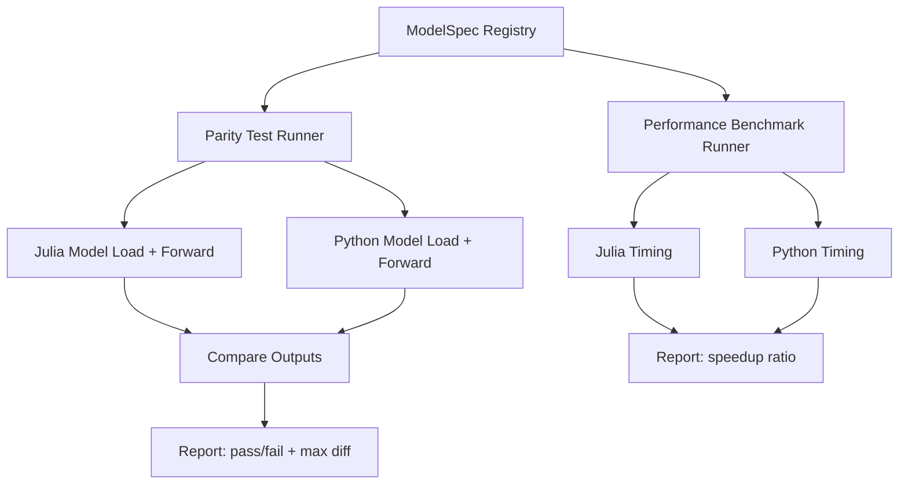

# Cross-Model Validation & Performance Framework

## Goal

Build a **reusable, extensible framework** that validates numerical parity and measures performance of every Transformers.jl model against the Python HuggingFace reference implementation. Adding a new model should require only a single registry entry.

## Current State

| What Exists | Where |
|---|---|
| Model load/roundtrip tests | `test/huggingface/load.jl` |
| Tokenizer parity tests (Julia vs Python) | `test/huggingface/tokenizer.jl` |
| PythonCall + `transformers` setup | `test/CondaPkg.toml` |
| Ad-hoc DistilBERT repro script | `repro_distilbert.jl` |
| **Model output parity testing** | **❌ Does not exist** |
| **Performance benchmarking** | **❌ Does not exist** |

## Architecture: Registry-Based Design

The key insight: all HuggingFace models in Transformers.jl follow the same pattern — load config, load model, run forward pass on a `NamedTuple` input. This lets us build a **data-driven** framework where each model is described by a `ModelSpec`, and the testing infrastructure is model-agnostic.



## Proposed File Structure

```
test/
├── huggingface/
│   ├── load.jl           # existing
│   ├── tokenizer.jl      # existing
│   └── parity.jl         # [NEW] model output parity tests
└── ...
benchmarks/
├── ModelValidation.jl     # [NEW] core framework module
├── run_parity.jl          # [NEW] standalone parity runner
├── run_benchmarks.jl      # [NEW] standalone perf runner
└── results/               # [NEW] output directory for reports
```

## Proposed Changes

---

### Core Framework

#### [NEW] [ModelValidation.jl](file:///home/abr/Documents/GitHub/Julia/Transformers.jl/benchmarks/ModelValidation.jl)

The heart of the framework — a module providing:

1. **`ModelSpec` struct** — describes one model + task combination:
   ```julia
   struct ModelSpec
       model_type::Symbol          # :bert, :gpt2, :distilbert, etc.
       task::Symbol                # :model, :formaskedlm, :forcausallm, etc.
       tiny_model_name::String     # "hf-internal-testing/tiny-random-BertModel"
       python_class::String        # "BertModel", "GPT2LMHeadModel", etc.
       input_builder::Function     # builds NamedTuple input for Julia
       python_input_builder::Function  # builds Python input dict
       output_keys::Vector{Symbol} # which output keys to compare
       atol::Float64               # absolute tolerance (default 1e-4)
   end
   ```

2. **`MODEL_REGISTRY`** — a `Dict{Tuple{Symbol,Symbol}, ModelSpec}` populated via `register_model!`:
   ```julia
   register_model!(
       model_type = :bert,
       task = :model,
       tiny_model = "hf-internal-testing/tiny-random-BertModel",
       python_class = "BertModel",
       output_keys = [:hidden_state],
   )
   ```

3. **`run_parity_check(spec::ModelSpec)`** — loads both Julia and Python models, runs forward passes, compares outputs element-wise. Returns a `ParityResult`:
   ```julia
   struct ParityResult
       spec::ModelSpec
       passed::Bool
       max_diff::Float64
       julia_time_s::Float64
       python_time_s::Float64
       error::Union{Nothing, String}
   end
   ```

4. **`run_benchmark(spec::ModelSpec; nsamples=100)`** — runs `@benchmark` on both sides, returns timing statistics.

5. **Default input builders** — reusable functions for common model architectures:
   - `encoder_input(; seq_len=10, batch=2, vocab_size=100)` — for BERT-like
   - `decoder_input(; seq_len=10, batch=2, vocab_size=100)` — for GPT-like
   - `seq2seq_input(...)` — for T5/BART
   - `vision_input(...)` — for CLIP vision
   - `multimodal_input(...)` — for full CLIP

6. **Report generation** — `generate_report(results::Vector{ParityResult})` that outputs a markdown table.

---

### Parity Test Integration

#### [NEW] [parity.jl](file:///home/abr/Documents/GitHub/Julia/Transformers.jl/test/huggingface/parity.jl)

Integrates into the existing test suite. Uses `@testset` to run parity checks on all registered models:

```julia
@testset "Model Output Parity" begin
    for (key, spec) in MODEL_REGISTRY
        @testset "$(spec.model_type) - $(spec.task)" begin
            result = run_parity_check(spec)
            @test result.passed
            @info "$(spec.model_type)/$(spec.task): max_diff=$(result.max_diff)"
        end
    end
end
```

---

### Standalone Runners

#### [NEW] [run_parity.jl](file:///home/abr/Documents/GitHub/Julia/Transformers.jl/benchmarks/run_parity.jl)

CLI-friendly script for running parity checks:
```bash
# All models
julia --project=. benchmarks/run_parity.jl

# Specific model
julia --project=. benchmarks/run_parity.jl --model bert

# Specific model+task
julia --project=. benchmarks/run_parity.jl --model bert --task formaskedlm
```

#### [NEW] [run_benchmarks.jl](file:///home/abr/Documents/GitHub/Julia/Transformers.jl/benchmarks/run_benchmarks.jl)

Performance comparison runner that outputs a markdown report:
```bash
julia --project=. benchmarks/run_benchmarks.jl --output benchmarks/results/report.md
```

---

## Adding a New Model

The whole point — adding a new model to validation requires **only one call**:

```julia
# In ModelValidation.jl, add to the default registry:
register_model!(
    model_type = :new_model,
    task = :model,
    tiny_model = "hf-internal-testing/tiny-random-NewModel",
    python_class = "NewModel",
    output_keys = [:hidden_state],
)
```

For models with non-standard architectures (like CLIP), you provide a custom input builder:

```julia
register_model!(
    model_type = :clip,
    task = :model,
    tiny_model = "hf-internal-testing/tiny-random-CLIPModel",
    python_class = "CLIPModel",
    input_builder = clip_multimodal_input,
    python_input_builder = clip_python_input,
    output_keys = [:logits],
)
```

## Key Design Decisions

> [!IMPORTANT]
> **Decision 1: Use tiny-random models for parity, not full models.**
> This keeps tests fast (no large downloads), reproducible, and CI-friendly. The existing `load.jl` test already uses these models successfully.

> [!IMPORTANT]
> **Decision 2: Separate parity from performance.**
> Parity tests run in CI (fast, deterministic). Performance benchmarks run separately (slower, hardware-dependent) and produce reports.

> [!NOTE]
> **Decision 3: PythonCall over subprocess.**
> Following the tokenizer test pattern, we use PythonCall for direct interop. This avoids serialization overhead and gives accurate comparison.

## Verification Plan

### Phase 1 — Framework + 3 Pilot Models
1. Implement `ModelValidation.jl` core module
2. Register DistilBERT, BERT, GPT-2 as pilot models
3. Verify parity passes for all 3
4. Generate first benchmark report

### Phase 2 — Full Model Coverage
5. Register all remaining models (RoBERTa, GPT-J, T5, BART, CLIP, etc.)
6. Handle special cases (CLIP multimodal, T5 seq2seq)
7. Integrate `parity.jl` into test suite

### Phase 3 — Polish
8. CLI argument parsing for standalone runners
9. Markdown report generation
10. Documentation
